在介绍有关transform相关的知识之前，先来讲一下`transform-origin`的用法以及关于`<angle>角度`的几种取值单位。另外，在使用时，为了兼容各个浏览器，可加上浏览器的私有前缀［－moz- -webkit -ms-］。

### transform-origin
设置对象变换的原点，通常和rotate旋转、scale缩放、skew斜切等一起使用，IE9+

2D情况下：默认值 50% 50%，即center center

3D情况下：默认值 50% 50% 0

取值介绍：

1. X轴：left｜center｜right｜length｜%
2. Y轴：top｜center｜bottom｜length｜%
3. Z轴：length

注意：如果只设置一个值，则该值作用于横坐标，纵坐标默认50%，Z轴默认为0，另外百分比是相对于自身进行计算的。

如：
```
{
  transform: rotate(45deg);
  transform-origin: 0 0;
  -ms-transform: rotate(45deg);     /* IE 9 */
  -ms-transform-origin: 0 0;          
  -moz-transform: rotate(45deg);    /* Firefox */
  -moz-transform-origin: 0 0; 
  -webkit-transform: rotate(45deg); /* Safari Opera and Chrome */ 
  -webkit-transform-origin: 0 0;
}
```
效果图：


### 角度的单位
CSS3新增，角度单位有四种，在所有可使用角度的地方均可使用这四种单位，但是需要注意兼容性，除turn单位外其他单位均可兼容IE9+浏览器版本。

单位说明：

90deg = 100grad = 0.25turn ≈ 1.570796326794897rad

| 单位 | 说明                                   |
| ---- | -------------------------------------- |
| deg  | 度数，一个圆共360度，IE9+              |
| grad | 梯度，一个圆共400梯度，IE9+            |
| rad  | 弧度，一个圆共2n弧度，IE9+             |
| turn | 转、圈，一个圆共1转，IE＋ FireFox13.0+ |


# transform
变换，可对元素进行位移、旋转、缩放、倾斜操作，支持2D或者3D转换，IE9+支持。

### 目录
* translate 位移
* rotate 旋转
* scale 缩放
* skew 斜切
* 变换综合应用

### translate 位移
对象进行2D空间或3D空间的位移。
使用规则：
```
translate(): 第一个参数指定X轴的位移量[必须], 第二个参数指定Y轴的位移量[当不设置时, 默认为0];
translateX(): 指定X轴的位移;
translateY(): 指定Y轴的位移;
translate3D(): 第一个参数指定X轴的位移量, 第二个参数指定Y轴的位移量, 第三个参数指定Z轴的位移量, 3个参数缺一不可;
translateZ(): 指定Z轴的位移;
```

使用translate时需要注意位移量的百分比是相对元素自身宽高来计算的。

translate有一个最常见的应用，即当元素宽度高度不固定时，使用translate可实现水平以及垂直方向的居中。

代码示例：
```
    dom结构
    <div class="box">
        <div class="item">center</div>
    </div>

    样式设计
    .box{
        position: relative;
        width: 300px;
        height: 300px;
        border: 1px solid;
    }
    .item{
        position: absolute;
        padding: 50px;
        background-color: #fb3;
        top: 50%; /*相对于父级*/
        left: 50%;
        
        transform: translate(-50%, -50%); /*相对自身*/

        -ms-transform: translate(-50%, -50%); 
        -moz-transform: translate(-50%, -50%); 
        -webkit-transform: translate(-50%, -50%); 
    }
```
效果图：


### rotate 旋转
对象进行2D空间或3D空间旋转。常与 transform-origin 一起使用。

使用规则：
```
rotate(): 2D旋转，根据指定的旋转角度进行旋转;
rotate3D(): 3D旋转，必须指定四个参数，前3个参数分别表示旋转的方向x y z, 第4个参数表示旋转的角度;
rotateX(): 指定X轴的旋转角度;
rotateY(): 指定Y轴的旋转角度;
rotateZ(): 指定Z轴的旋转角度;
```
使用rotate时需要注意以下几点：

1. 旋转角度必须有单位，否则将报错。
2. rotate值为正值时，顺时针旋转；否则逆时针旋转。
3. 在2D情况下，rotate()只能指定一个参数；在3D情况下，rotate3D()必须指定四个参数，否则将报错。

旋转45度，代码示例：
```
    /* X轴旋转45度 */
    .item1{
        transform: rotateX(-45deg);

        -moz-transform: rotateX(-45deg);
        -ms-transform: rotateX(-45deg);
        -webkit-transform: rotateX(-45deg);
    }

    /* Y轴旋转45度 */
    .item2{
        transform: rotateY(-45deg);

        -moz-transform: rotateY(-45deg);
        -ms-transform: rotateY(-45deg);
        -webkit-transform: rotateY(-45deg);
    }
    
    /* Z轴旋转45度 */    
    .item3{
        transform: rotateZ(-45deg);

        -moz-transform: rotateZ(-45deg);
        -ms-transform: rotateZ(-45deg);
        -webkit-transform: rotateZ(-45deg);
    }
```
示例图：

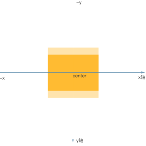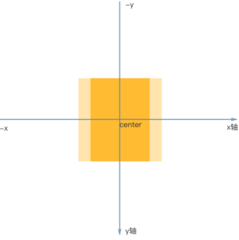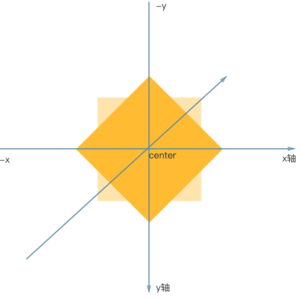

上述例子中的 ```rotateZ(-45deg); ```也可以写成 ```rotate3D(0,0,1,-45deg);```，当然相对于X轴、Y轴的也可使用rotate3d的简写形式。

另外，不难看出只指定Z轴的旋转与2D旋转的效果一致。即以下三种写法得到的旋转效果是一样的：
```
transform: rotate(-45deg);

transform: rotate3D(0,0,1,-45deg);

transform: rotateZ(-45deg);
```

### scale 缩放
对象进行2D空间或3D空间缩放。常与 transform-origin 一起使用。

使用规则：
```
scale(): 第一个参数指定X轴的缩放倍数[必须], 第二个参数指定Y轴的缩放倍数[当不设置时, 默认取第一个参数的值];;
scaleX(): 指定X轴的缩放倍数;
scaleY(): 指定Y轴的缩放倍数;
scale3D(): 第一个参数指定X轴的缩放倍数, 第二个参数指定Y轴的缩放倍数, 第三个参数指定Z轴的缩放倍数, 3个参数缺一不可;
scaleZ(): 指定Z轴的缩放倍数;
```
使用scale时需要注意以下几点：

1. 参数值为倍数，如：```scale(2);``` 表示放大2倍。
2. 参数值是分别相对元素的宽和高进行计算的。即便是scale只设置了一个值，那也是分别计算的。
3. 参数值大于1表示放大；0～1之间为缩小；1表示不变；0的时候元素不可见。
4. 参数值为负数时，除了元素的方向发生改变[x轴反转]，其他规律与正值一致。

负值的情况，代码示例：
```
    dom结构
    <div class="box">
        <div class="item">Item</div>
    </div>

    样式设计
    .box{
        width: 300px;
        height: 300px;
        border: 1px solid;
    }
    .item{
        width: 100px;
        height: 100px;
        line-height: 100px;
        text-align: center;
        background-color: #fb3;

        transform: scale(-1.2);

        -ms-transform: scale(-1.2);
        -moz-transform: scale(-1.2);
        -webkit-transform: scale(-1.2);
    }
```
效果图：

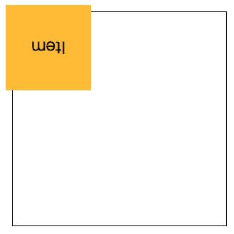

图中可看出，元素相对于x轴发生了反转，但是缩放效果并没有受影响。

### skew 斜切
对象进行2D空间斜切。常与 transform-origin 一起使用。

使用规则：
```
skew(): 第一个参数对应X轴[必须], 第二个参数对应Y轴[当不设置时, 默认为0];;
skewX(): 指定X轴的斜切;
skewY(): 指定Y轴的斜切;
```

### 综合应用
* 平行四边形
* 梯形
* 菱形
* 折角

#### 平行四边形

原理：使用skew斜切来实现。

先看效果图：


看到效果图，最先想到的是对元素使用skew斜切效果。

简单使用斜切代码：

```
    dom结构：
    <div class="btn">Home</div>

    样式设计：
    .btn{
        width: 150px;
        height: 40px;
        text-align: center;
        line-height: 40px;
        background-color: #fb3;

        transform: skew(-45deg);

        -moz-transform: skew(-45deg);
        -ms-transform: skew(-45deg);
        -webkit-transform: skew(-45deg);
    }
```
确实实现了平行四边形的效果，但是里面的内容也被斜切了，并不完美。


下面介绍两种方向来实现平行四边形，且内容不会受影响。

第一种是比较常见的，嵌套一层结构，父元素进行斜切，子元素抵消掉斜切。

代码：
```
    dom结构：
    <div class=".box">
        <div class="btn">home</div> 
    </div>

    样式设计：
    .box{
        width: 150px;
        height: 40px;
        text-align: center;
        line-height: 40px;
        background-color: #fb3;

        transform: skew(-45deg);

        -moz-transform: skew(-45deg);
        -ms-transform: skew(-45deg);
        -webkit-transform: skew(-45deg);
    }
    .btn{
        transform: skew(45deg);

        -moz-transform: skew(45deg);
        -ms-transform: skew(45deg);
        -webkit-transform: skew(45deg); 
    }
```
第二种方法是使用伪元素，将斜切背景应用在伪元素上。

代码：
```
    dom结构：
    <div class="btn">home</div> 

    样式设计：
    .btn{
        position: relative;
        width: 150px;
        height: 40px;
        text-align: center;
        line-height: 40px;
    }
    .btn:after{
        position:absolute;
        content: '';
        width: 100%;
        height: 100%;
        top: 0;
        left: 0;
        background-color: #fb3;

        z-index: -1; /* 保证背景不会覆盖住文字 */

        transform: skew(-45deg);

        -moz-transform: skew(-45deg);
        -ms-transform: skew(-45deg);
        -webkit-transform: skew(-45deg); 
    }
```

#### 梯形
梯形的实现相对平行四边形来说要复杂一些，需要借助perspective()透视来实现。

先看效果图：

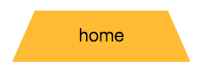

代码：
```
    dom结构：
    <div class="box">home</div>

    基本样式
    .box {
        position: relative;
        width: 200px;
        height: 60px;
        margin: 50px;
        line-height: 60px;
        text-align: center;
    }
```

下面来说明一下如何实现梯形效果：

和平行四边形的原理一样，梯形的背景仍要写在伪元素上，以防止字体变形。

代码如下：
```
    .box:after {
        position: absolute;
        content: '';
        top: 0;
        left: 0;
        right: 0;
        bottom: 0;
        z-index: -1;
        background-color: #fb3;
        transform: perspective(20px) rotatex(5deg);

        -moz-transform: perspective(20px) rotatex(5deg);
        -ms-transform: perspective(20px) rotatex(5deg);
        -webkit-transform: perspective(20px) rotatex(5deg);
    }  
```

为更好的查看效果，可以给box加上半透明的背景，效果图：

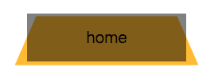

旋转是以元素的中心线进行旋转的，所以要修改一下旋转原点，增加以下代码：
```
    transform-origin: bottom;
    －moz-transform-origin: bottom;
    -ms-transform-origin: bottom;
    -webkit-transform-origin: bottom;
```
在看效果图：

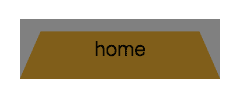

这时可以发现，元素的高度已经严重缩水了，这时候可以使用scale进行y轴的缩放，修改transform代码如下：
```
    transform: perspective(20px) rotatex(5deg) scaley(1.3);
    －moz-transform-origin: perspective(20px) rotatex(5deg) scaley(1.3);
    -ms-transform-origin: perspective(20px) rotatex(5deg) scaley(1.3);
    -webkit-transform-origin: perspective(20px) rotatex(5deg) scaley(1.3);
```
效果：

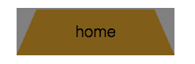

当然也可以利用修改transform-origin的值实现不同的梯形。

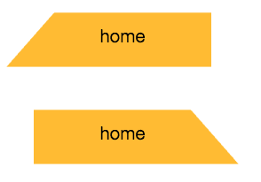

代码如下[别忘记兼容性，加上浏览器前缀]：
```
    右侧直角
    transform-origin: right;
    transform: perspective(20px) rotatex(5deg);

    左侧直角
    transform-origin: left;
    transform: perspective(20px) rotatex(5deg);
```

#### 菱形
菱形的实现有两种，第一种是有rotate结合scale实现，第二种是用clip-path实现。

首先对父级进行旋转
代码：
```
    dom结构
    <div class="box">
        
    </div>

    基本样式设计：
    .box{
        width: 200px;
        height: 200px;
        border: 1px solid;
        overflow: hidden;

        transform: rotate(45deg);
        -mos-transform: rotate(45deg);
        -mz-transform: rotate(45deg);
        -webkit-transform: rotate(45deg);
    }
    .box img{
        width: 100%;
    }
```
效果图：


现在可以加上scale属性了，更改transform属性为：
```
    transform: rotate(-45deg) scale(1.41);
```


但是这个方法有限制，每次必须要计算scale放大的比例，并且当图片不是正方形时，就没办法实现较好的菱形效果。

第二种方案，使用clip-path实现。不需要嵌套任何元素。
```
    clip-path: polygon(0 50%, 50% 0, 100% 50%, 50% 100%);
```
效果图：

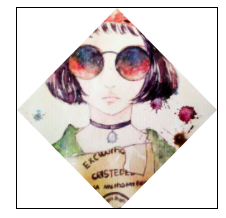

#### 折角效果
如果是规则的折角图案，如下图所示，可直接用background实现，详情可见文章[背景应用](https://github.com/junruchen/junruchen.github.io/wiki/CSS-Background%E7%A5%9E%E5%A5%87%E7%9A%84%E6%B8%90%E5%8F%98%E8%89%B2)

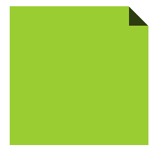

[代码就不过多说明了]代码示例：
```
    dom结构
    <div class="box"></div>

    基本样式
    .box {
        width: 200px;
        height: 200px;
        background-color: #58a; /*hack 回退*/
        background: linear-gradient(225deg, transparent 20px, rgba(0, 0, 0, .7) 0), linear-gradient(225deg, transparent 20px, yellowgreen 0);
        background-size: 28px, 100%;
        background-repeat: no-repeat;
        background-position: right top, center;
    }
```

不同角度的折角实现：

效果图：


代码：
```
    .box{
        position: relative;
        background-color: #58a; /*hack 回退*/
        background: linear-gradient(-150deg, transparent 30px, yellowgreen 0);
    }

    .box:before {
        position: absolute;
        content: '';
        width: 62px;
        height: 34px;
        top: 0;
        right: 0;
        background: linear-gradient(-30deg, transparent 30px, rgba(0, 0, 0, .7) 0);
        transform: rotate(-120deg); 
   }
```

仍需要借助渐变色实现背景，然后旋转。

也可以进行更多的优化，如阴影，圆角，效果图如下：


