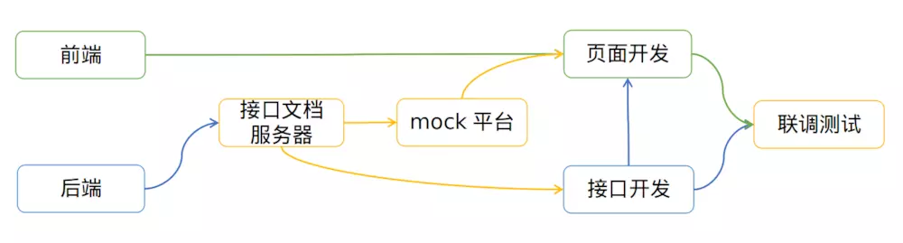
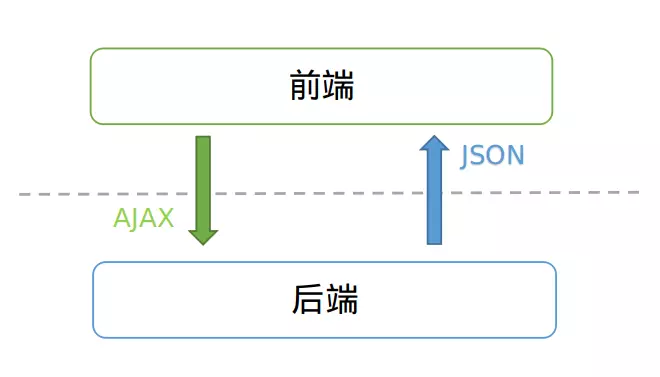
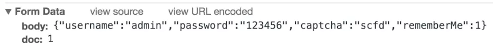
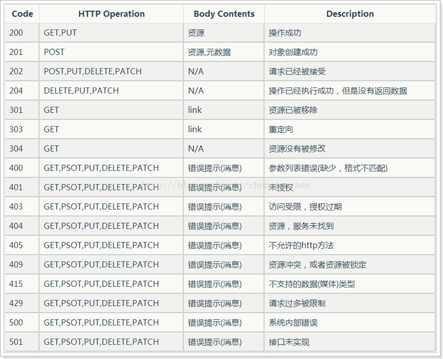

# 接口规范

## 开发流程



## HTTP API 协议

### RESTful

Representational State Transfer, RESTful 一组架构约束条件和原则, 在 2000 年由 Roy Fielding 提出


###  GraphQL

GraphQL 是一个用于 API 的查询语言, 在 2015 年由 Facebook 开源


## 规范原则

- 接口返回数据即显示：前端仅做渲染逻辑处理；
- 渲染逻辑禁止跨多个接口调用；
- 前端关注交互、渲染逻辑，尽量避免业务逻辑处理的出现；
- 请求响应传输数据格式：JSON，JSON数据尽量简单轻量，避免多级JSON的出现；




## Laravel 分页名词翻译

**响应 JSON释义**

```js
{
   "total": 50, //记录总条数
   "per_page": 15, //每页显示的记录条数
   "current_page": 1, //当前页
   "last_page": 4, //总页数
   "first_page_url": "http://laravel.app?page=1",
   "last_page_url": "http://laravel.app?page=4",
   "next_page_url": "http://laravel.app?page=2",
   "prev_page_url": null,
   "path": "http://laravel.app",
   "from": 1, //当前页的第一条
   "to": 15, //当前页的最后一条
   "data":[
        {
            // Result Object
        },
        {
            // Result Object
        }
   ]
}
```

**paginate 方法**

| 方法                                                    | 描述                                                       |
| ------------------------------------------------------- | ---------------------------------------------------------- |
| $results->count()                                       | 获取当前页的项目数                                         |
| $results->currentPage()                                 | 获取当前页的页码                                           |
| $results->firstItem()                                   | 获取结果集分片中第一项的编号                               |
| $results->getOptions()                                  | 获取分页选项                                               |
| $results->getUrlRange($start, $end)	创建分页 URL 的范围 |
| $results->hasMorePages()                                | 判断是否还有足够多的项目用于分页                           |
| $results->lastItem()                                    | 获取结果集分片中最后一项的编号                             |
| $results->lastPage()                                    | 获取最后一页的页码(使用 simplePaginate 时无效)             |
| $results->nextPageUrl()                                 | 获取下一页的 URL                                           |
| $results->onFirstPage()                                 | 判断是否在第一页                                           |
| $results->perPage()                                     | 每页显示的项目数                                           |
| $results->previousPageUrl()                             | 获取上一页的 URL                                           |
| $results->total()                                       | 判断存储器中匹配的所有项目总数(使用 simplePaginate 时无效) |
| $results->url($page)                                    | 获取给定页码的分页 URL                                     |


## 请求基本格式

### GET请求

```
xxx/login?body={"username":"admin","password":"123456","captcha":"scfd","rememberMe":1}
```

### POST请求



## 响应格式

### 响应基本格式

```js
{
    code: 200,
    data: {
        message: "success"
    }
}
```
### 响应实体格式

```js
{
    code: 200,
    data: {
        message: "success",
        entity: {
            id: 1,
            name: "XXX",
            code: "XXX"
        }
    }
}
```
> data.entity: 响应返回的实体数据

### 响应列表格式

```js
{
    code: 200,
    data: {
        message: "success",
        list: [
            {
                id: 1,
                name: "XXX",
                code: "XXX"
            },
            {
                id: 2,
                name: "XXX",
                code: "XXX"
            }
        ]
    }
}
```
> data.list: 响应返回的列表数据

### 响应分页格式
```js
{
    code: 200,
    data: {
        recordCount: 2,
        message: "success",
        totalCount: 2,
        pageNo: 1,
        pageSize: 10,
        list: [
            {
                id: 1,
                name: "XXX",
                code: "H001"
            },
            {
                id: 2,
                name: "XXX",
                code: "H001"
            } ],
        totalPage: 1
    }
}
```
> - data.recordCount: 当前页记录数
> - data.totalCount: 总记录数
> - data.pageNo: 当前页码
> - data.pageSize: 每页大小
> - data.totalPage: 总页数

### 下拉框、复选框、单选框
```js
{
    code: 200,
    data: {
        message: "success",
        list: [{
            id: 1,
            name: "XXX",
            code: "XXX",
            isSelect: 1
        }, {
            id: 1,
            name: "XXX",
            code: "XXX",
            isSelect: 0
        }]
    }
}
```


## 接口错误状态码



### 前端接收错误状态码

```js
  if (err && err.response) {
    switch (err.response.status) {
      case 400:
        err.message = '错误请求'
        break
      case 401:
        err.message = '未授权，请重新登录'
        break
      case 403:
        err.message = '拒绝访问'
        break
      case 404:
        err.message = '请求错误,未找到该资源'
        break
      case 405:
        err.message = '请求方法未允许'
        break
      case 408:
        err.message = '请求超时'
        break
      case 500:
        err.message = '服务器端出错'
        break
      case 501:
        err.message = '网络未实现'
        break
      case 502:
        err.message = '网络错误'
        break
      case 503:
        err.message = '服务不可用'
        break
      case 504:
        err.message = '网络超时'
        break
      case 505:
        err.message = 'http版本不支持该请求'
        break
      default:
        err.message = `连接错误${err.response.status}`
    }
  } else {
    err.message = '连接服务器失败'
  }
```

## Web 研发模式的演变

### 简单明快的早期时代


### 后端为主的 MVC 时代


### Ajax 带来的 SPA 时代


### 前端为主的 MVVM（Model-View-ViewModel） 时代


### Node 带来的全栈时代


> - [前后分离接口规范](https://www.jianshu.com/p/c81008b68350?from=timeline)
> - [Web 开发模式的演变](http://blog.jobbole.com/65509/)


## Chrome

```js
chrome://about
chrome://serviceworker-internals
```

[微信开发者调试](http://debugtbs.qq.com/)

## 微擎 FTP 路径

```bash
/data/wwwroot/a554.mxnt.net/addons/ewei_shopv2/core/mobile/member
```


# php 数组对象之间的转换


从 5.2 版本开始，PHP 原生提供 json_encode() 和 json_decode() 函数，前者用于编码，后者用于解码。

**一、json_encode()**

```php
<?php
  $arr = array ('a'=>1,'b'=>2,'c'=>3,'d'=>4,'e'=>5);
  echo json_encode($arr);
?>
```

输出

```php
{"a":1,"b":2,"c":3,"d":4,"e":5}
```

再看一个对象转换的例子：

```php
$obj->body           = 'another post';
$obj->id             = 21;
$obj->approved       = true;
$obj->favorite_count = 1;
$obj->status         = NULL;
echo json_encode($obj);
```

 输出

```php
{
　　　"body":"another post",
　
　　　"id":21,
　
　　　"approved":true,
　
　　　"favorite_count":1,
　
　　　"status":null
}
```

 由于 json 只接受 utf-8 编码的字符，所以 json_encode() 的参数必须是 utf-8 编码，否则会得到空字符或者 null。当中文使用 GB2312 编码，或者外文使用 ISO-8859-1 编码的时候，这一点要特别注意。

**二、索引数组和关联数组**

PHP 支持两种数组，一种是只保存 "值"（value）的索引数组（indexed array），另一种是保存 "名值对"（name/value）的关联数组（associative array）。

由于 javascript 不支持关联数组，所以 json_encode() 只将索引数组（indexed array）转为数组格式，而将关联数组（associative array）转为对象格式。

比如，现在有一个索引数组

```php
$arr = Array('one', 'two', 'three');
 
echo json_encode($arr);
```

 输出

```php
["one","two","three"]
```


 如果将它改为关联数组：

```php
$arr = Array('1'=>'one', '2'=>'two', '3'=>'three');
　
echo json_encode($arr);
```

 输出变为

```php
{"1":"one","2":"two","3":"three"}
```

 注意，数据格式从 "[]"（数组）变成了 "{}"（对象）。

如果你需要将 "索引数组" 强制转化成 "对象"，可以这样写

```php
	json_encode( (object)$arr );
```

 或者

```php
json_encode ( $arr, JSON_FORCE_OBJECT );
```

** 三、类（class）的转换**

下面是一个 PHP 的类：

```php
class Foo {
 
　　const     ERROR_CODE = '404';
 
　　public    $public_ex = 'this is public';
 
　　private   $private_ex = 'this is private!';
 
　　protected $protected_ex = 'this should be protected';
　
　　public function getErrorCode() {
 
　　　　return self::ERROR_CODE;
 
　　}
 
}
```

 现在，对这个类的实例进行 json 转换：

```php
$foo = new Foo;
 
$foo_json = json_encode($foo);
 
echo $foo_json;
```

 输出结果是

```php
{"public_ex":"this is public"}
```

 可以看到，除了公开变量（public），其他东西（常量、私有变量、方法等等）都遗失了。

**四、json_decode()**

该函数用于将 json 文本转换为相应的 PHP 数据结构。下面是一个例子：

```php
$json = '{"foo": 12345}';
　
$obj = json_decode($json);
 
print $obj->{'foo'}; // 12345
```

 通常情况下，json_decode() 总是返回一个 PHP 对象，而不是数组。比如：

```php
$json = '{"a":1,"b":2,"c":3,"d":4,"e":5}';
　
var_dump(json_decode($json));
```

 结果就是生成一个 PHP 对象：

```php
object(stdClass)#1 (5) {
 
　　["a"] => int(1)
　　["b"] => int(2)
　　["c"] => int(3)
　　["d"] => int(4)
　　["e"] => int(5)
 
}
```

 如果想要强制生成 PHP 关联数组，json_decode() 需要加一个参数 true：

```php
$json = '{"a":1,"b":2,"c":3,"d":4,"e":5}';
　　
var_dump(json_decode($json,true));
```

 结果就生成了一个关联数组：

```php
array(5) {
 
 　　["a"] => int(1)
 　　["b"] => int(2)
 　　["c"] => int(3)
 　　["d"] => int(4)
 　　["e"] => int(5)
 
}
```

**五、json_decode() 的常见错误**

下面三种 json 写法都是错的，你能看出错在哪里吗？

```php
$bad_json = "{ 'bar': 'baz' }";
 
$bad_json = '{ bar: "baz" }';
 
$bad_json = '{ "bar": "baz", }';
```

 对这三个字符串执行 json_decode() 都将返回 null，并且报错。

第一个的错误是，json 的分隔符（delimiter）只允许使用双引号，不能使用单引号。第二个的错误是，json 名值对的 "名"（冒号左边的部分），任何情况下都必须使用双引号。第三个的错误是，最后一个值之后不能添加逗号（trailing comma）。

另外，json 只能用来表示对象（object）和数组（array），如果对一个字符串或数值使用 json_decode()，将会返回 null。

```php
var_dump(json_decode("Hello World")); //null
```
