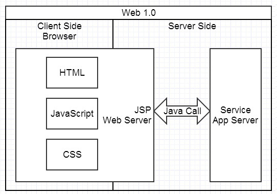
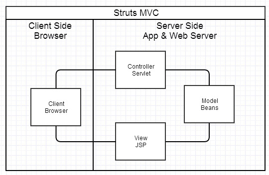
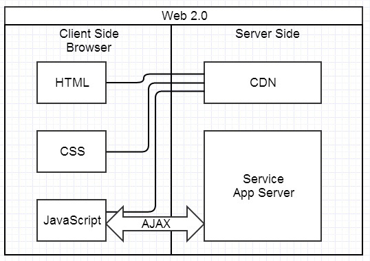
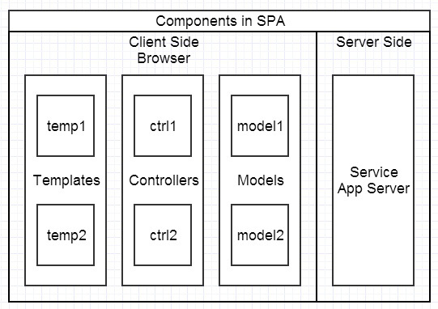

# Web 研发模式的演变

## 简单明快的早期时代

## 后端为主的 MVC 时代

## Ajax 带来的 SPA 时代

## 前端为主的 MVVM（Model-View-ViewModel） 时代

## Node 带来的全栈时代

> - [前后分离接口规范](https://www.jianshu.com/p/c81008b68350?from=timeline)
> - [Web 开发模式的演变](http://blog.jobbole.com/65509/)
