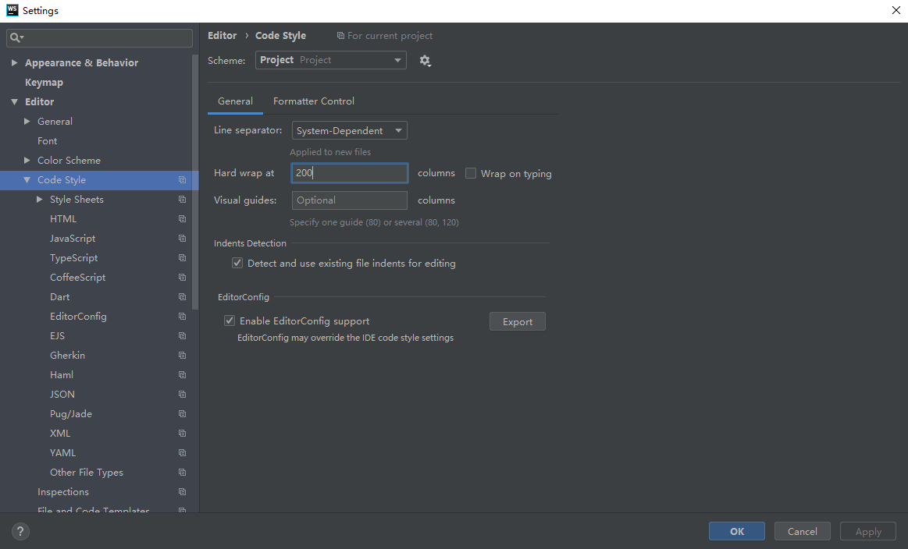
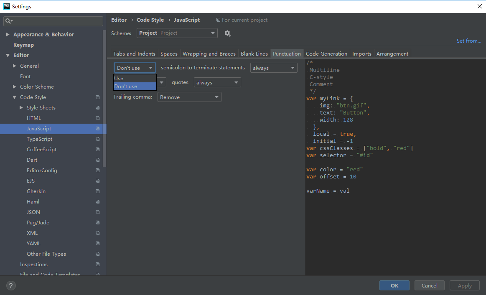
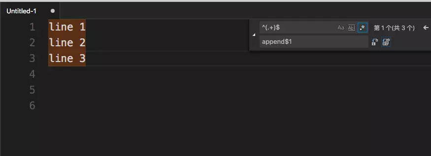
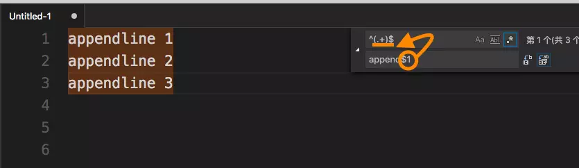

# Windows

## CMD 常用命令

| 命令              | 释义                     |
| ----------------- | ------------------------ |
| cmd /?            |                          |
| cd /d ..          | 进入目录（跨驱动器）     |
| copy              | 复制                     |
| start .           | 文件管理器打开目录       |
| md                | 创建目录                 |
| dir               | 显示文件和目录的详细资料 |
| tree /F >tree.txt | 将项目结构保存到 txt     |
| systeminfo        | 查看当前计算机的综合信息 |
| set               | 显示 Windows 环境变量    |
| ipconfig          | 查看网络配置             |
| netstat           | 查看网络状态             |
| ping              | 检查与目标主机的连通性   |
| arp               | 查看本机的ARP缓存表      |
| cls               | 清屏                     |
| sc                | 服务                     |
| mstsc             | 远程桌面连接             |


```bash
# 新建文件夹和文件
cd ..           返回上一级
md test         新建test文件夹
md d:\test\my   d盘下新建文件夹
cd test         进入test文件夹
cd.>cc.txt      新建cc.txt文件
dir             列出文件夹下所有文件及文件夹

# 删除文件夹和文件
cd test         进入test文件夹
dir             查看所有文件目录
del a.txt       删除a.txt的文件
del *.txt       删除所有后缀为.txt的文件
rd test         删除名为test的空文件夹
rd /s D:\test   删除D盘里的test文件夹  会出现如下 test, 是否确认(Y/N)?  直接输入 Y 在回车
rd test/s       删除此文件夹下的所有文件  test, 是否确认(Y/N)?  直接输入 Y 在回车
```

## 中国镜像

```bash
# composer 中国镜像
composer config -gl
composer config -g repo.packagist composer https://packagist.phpcomposer.com

# yum 中国镜像
wget -O /etc/yum.repos.d/CentOS-Base.repo http://mirrors.aliyun.com/repo/Centos-7.repo

# npm 中国镜像
npm config get registry
npm config set registry https://registry.npm.taobao.org

# yarn 中国镜像
yarn config get registry
yarn config set registry https://registry.npm.taobao.org

# gem 中国镜像
gem sources --add https://gems.ruby-china.org/ --remove https://rubygems.org/
gem sources -l
*** CURRENT SOURCES ***

https://gems.ruby-china.org
# 请确保只有 gems.ruby-china.org
gem install rails

# pip国内源
pip install web.py -i http://pypi.douban.com/simple
```
## PHPstorm 激活

### 密钥激活

1. 修改 hosts

```bash
# 在文件管理器粘贴以下地址即可
C:\windows\system32\drivers\etc

# 在hosts文件加入以下内容
# 建议使用 listary 或 phpstudy 修改hosts
0.0.0.0 account.jetbrains.com
```

2. 粘贴激活码

> 注册码有效期为2019年3月10日至2020年3月11日，由 [lanyus](http://idea.lanyus.com/) 提供，适用于 Jetbrains 旗下所有 IDE

```
56ZS5PQ1RF-eyJsaWNlbnNlSWQiOiI1NlpTNVBRMVJGIiwibGljZW5zZWVOYW1lIjoi5q2j54mI5o6I5p2DIC4iLCJhc3NpZ25lZU5hbWUiOiIiLCJhc3NpZ25lZUVtYWlsIjoiIiwibGljZW5zZVJlc3RyaWN0aW9uIjoiRm9yIGVkdWNhdGlvbmFsIHVzZSBvbmx5IiwiY2hlY2tDb25jdXJyZW50VXNlIjpmYWxzZSwicHJvZHVjdHMiOlt7ImNvZGUiOiJJSSIsInBhaWRVcFRvIjoiMjAyMC0wMy0xMCJ9LHsiY29kZSI6IkFDIiwicGFpZFVwVG8iOiIyMDIwLTAzLTEwIn0seyJjb2RlIjoiRFBOIiwicGFpZFVwVG8iOiIyMDIwLTAzLTEwIn0seyJjb2RlIjoiUFMiLCJwYWlkVXBUbyI6IjIwMjAtMDMtMTAifSx7ImNvZGUiOiJHTyIsInBhaWRVcFRvIjoiMjAyMC0wMy0xMCJ9LHsiY29kZSI6IkRNIiwicGFpZFVwVG8iOiIyMDIwLTAzLTEwIn0seyJjb2RlIjoiQ0wiLCJwYWlkVXBUbyI6IjIwMjAtMDMtMTAifSx7ImNvZGUiOiJSUzAiLCJwYWlkVXBUbyI6IjIwMjAtMDMtMTAifSx7ImNvZGUiOiJSQyIsInBhaWRVcFRvIjoiMjAyMC0wMy0xMCJ9LHsiY29kZSI6IlJEIiwicGFpZFVwVG8iOiIyMDIwLTAzLTEwIn0seyJjb2RlIjoiUEMiLCJwYWlkVXBUbyI6IjIwMjAtMDMtMTAifSx7ImNvZGUiOiJSTSIsInBhaWRVcFRvIjoiMjAyMC0wMy0xMCJ9LHsiY29kZSI6IldTIiwicGFpZFVwVG8iOiIyMDIwLTAzLTEwIn0seyJjb2RlIjoiREIiLCJwYWlkVXBUbyI6IjIwMjAtMDMtMTAifSx7ImNvZGUiOiJEQyIsInBhaWRVcFRvIjoiMjAyMC0wMy0xMCJ9LHsiY29kZSI6IlJTVSIsInBhaWRVcFRvIjoiMjAyMC0wMy0xMCJ9XSwiaGFzaCI6IjEyMjkxNDk4LzAiLCJncmFjZVBlcmlvZERheXMiOjAsImF1dG9Qcm9sb25nYXRlZCI6ZmFsc2UsImlzQXV0b1Byb2xvbmdhdGVkIjpmYWxzZX0=-SYSsDcgL1WJmHnsiGaHUWbaZLPIe2oI3QiIneDtaIbh/SZOqu63G7RGudSjf3ssPb1zxroMti/bK9II1ugHz/nTjw31Uah7D0HqeaCO7Zc0q9BeHysiWmBZ+8bABs5vr25GgIa5pO7CJhL7RitXQbWpAajrMBAeZ2En3wCgNwT6D6hNmiMlhXsWgwkw2OKnyHZ2dl8yEL+oV5SW14t7bdjYGKQrYjSd4+2zc4FnaX88yLnGNO9B3U6G+BuM37pxS5MjHrkHqMTK8W3I66mIj6IB6dYXD5nvKKO1OZREBAr6LV0BqRYSbuJKFhZ8nd6YDG20GvW6leimv0rHVBFmA0w==-MIIElTCCAn2gAwIBAgIBCTANBgkqhkiG9w0BAQsFADAYMRYwFAYDVQQDDA1KZXRQcm9maWxlIENBMB4XDTE4MTEwMTEyMjk0NloXDTIwMTEwMjEyMjk0NlowaDELMAkGA1UEBhMCQ1oxDjAMBgNVBAgMBU51c2xlMQ8wDQYDVQQHDAZQcmFndWUxGTAXBgNVBAoMEEpldEJyYWlucyBzLnIuby4xHTAbBgNVBAMMFHByb2QzeS1mcm9tLTIwMTgxMTAxMIIBIjANBgkqhkiG9w0BAQEFAAOCAQ8AMIIBCgKCAQEAxcQkq+zdxlR2mmRYBPzGbUNdMN6OaXiXzxIWtMEkrJMO/5oUfQJbLLuMSMK0QHFmaI37WShyxZcfRCidwXjot4zmNBKnlyHodDij/78TmVqFl8nOeD5+07B8VEaIu7c3E1N+e1doC6wht4I4+IEmtsPAdoaj5WCQVQbrI8KeT8M9VcBIWX7fD0fhexfg3ZRt0xqwMcXGNp3DdJHiO0rCdU+Itv7EmtnSVq9jBG1usMSFvMowR25mju2JcPFp1+I4ZI+FqgR8gyG8oiNDyNEoAbsR3lOpI7grUYSvkB/xVy/VoklPCK2h0f0GJxFjnye8NT1PAywoyl7RmiAVRE/EKwIDAQABo4GZMIGWMAkGA1UdEwQCMAAwHQYDVR0OBBYEFGEpG9oZGcfLMGNBkY7SgHiMGgTcMEgGA1UdIwRBMD+AFKOetkhnQhI2Qb1t4Lm0oFKLl/GzoRykGjAYMRYwFAYDVQQDDA1KZXRQcm9maWxlIENBggkA0myxg7KDeeEwEwYDVR0lBAwwCgYIKwYBBQUHAwEwCwYDVR0PBAQDAgWgMA0GCSqGSIb3DQEBCwUAA4ICAQAF8uc+YJOHHwOFcPzmbjcxNDuGoOUIP+2h1R75Lecswb7ru2LWWSUMtXVKQzChLNPn/72W0k+oI056tgiwuG7M49LXp4zQVlQnFmWU1wwGvVhq5R63Rpjx1zjGUhcXgayu7+9zMUW596Lbomsg8qVve6euqsrFicYkIIuUu4zYPndJwfe0YkS5nY72SHnNdbPhEnN8wcB2Kz+OIG0lih3yz5EqFhld03bGp222ZQCIghCTVL6QBNadGsiN/lWLl4JdR3lJkZzlpFdiHijoVRdWeSWqM4y0t23c92HXKrgppoSV18XMxrWVdoSM3nuMHwxGhFyde05OdDtLpCv+jlWf5REAHHA201pAU6bJSZINyHDUTB+Beo28rRXSwSh3OUIvYwKNVeoBY+KwOJ7WnuTCUq1meE6GkKc4D/cXmgpOyW/1SmBz3XjVIi/zprZ0zf3qH5mkphtg6ksjKgKjmx1cXfZAAX6wcDBNaCL+Ortep1Dh8xDUbqbBVNBL4jbiL3i3xsfNiyJgaZ5sX7i8tmStEpLbPwvHcByuf59qJhV/bZOl8KqJBETCDJcY6O2aqhTUy+9x93ThKs1GKrRPePrWPluud7ttlgtRveit/pcBrnQcXOl1rHq7ByB8CFAxNotRUYL9IF5n3wJOgkPojMy6jetQA5Ogc8Sm7RG6vg1yow==
```

### 账号激活

> 此账号终身有效，不限操作系统，适用于 Jetbrains 旗下所有 IDE

| 账号             | 密码            |
| ---------------- | --------------- |
| 527455294@qq.com | dwVTG5j5Ln7LeN_ |


## Sublime3 激活

```bash
# hosts
127.0.0.1 license.sublimehq.com 
127.0.0.1 45.55.255.55 
127.0.0.1 45.55.41.223

# cmd 刷新dns解析缓存
ipconfig /flushdns

# 注册码
—– BEGIN LICENSE —– 
sgbteam 
Single User License 
EA7E-1153259 
8891CBB9 F1513E4F 1A3405C1 A865D53F 
115F202E 7B91AB2D 0D2A40ED 352B269B 
76E84F0B CD69BFC7 59F2DFEF E267328F 
215652A3 E88<kbd>F9</kbd>D8F 4C38E3BA 5B2DAAE4 
969624E7 DC9CD4D5 717FB40C 1B9738CF 
20B3C4F1 E917B5B3 87C38D9C ACCE7DD8 
5F7EF854 86B9743C FADC04AA FB0DA5C0 
<kbd>F9</kbd>13BE58 42FEA319 <kbd>F9</kbd>54EFDD AE881E0B 
—— END LICENSE ——
```

## PHPstorm 插件

```bash
# 局域网镜像站
# 在文件管理器粘贴以下地址即可
# 如遇到需要输入用户名密码，则用户名为LJW，密码为空

\\192.168.1.100\nas\idea
```

## Webstorm 设置

1. 中间白线



2. 分号



## Chrome 插件

```bash
# 局域网镜像站
# 在文件管理器粘贴以下地址即可
# 如遇到需要输入用户名密码，则用户名为LJW，密码为空

\\192.168.1.100\nas\crx
```

## 开发工具

```bash
# 局域网镜像站
# 在文件管理器粘贴以下地址即可
# 如遇到需要输入用户名密码，则用户名为LJW，密码为空

\\192.168.1.100\nas\exe
```


## 主板 BIOS 启动键

> 主板 BIOS 启动键

| 主板品牌     | 启动按键                                     | 笔记本品牌      | 启动按键       | 台式机品牌     | 启动按键       |
| ------------ | -------------------------------------------- | --------------- | -------------- | -------------- | -------------- |
| 华硕主板     | <kbd>F8</kbd>                                | 联想笔记本      | <kbd>F12</kbd> | 联想台式机     | <kbd>F12</kbd> |
| 技嘉主板     | <kbd>F12</kbd>                               | 宏基笔记本      | <kbd>F12</kbd> | 惠普台式机     | <kbd>F12</kbd> |
| 微星主板     | <kbd>F11</kbd>                               | 华硕笔记本      | <kbd>Esc</kbd> | 宏基台式机     | <kbd>F12</kbd> |
| 映泰主板     | <kbd>F9</kbd>                                | 惠普笔记本      | <kbd>F9</kbd>  | 戴尔台式机     | <kbd>Esc</kbd> |
| 梅捷主板     | <kbd>Esc</kbd> 或 &nbsp;&nbsp;<kbd>F12</kbd> | 联想Thinkpad    | <kbd>F12</kbd> | 神舟台式机     | <kbd>F12</kbd> |
| 七彩虹主板   | <kbd>Esc</kbd> 或 &nbsp;&nbsp;<kbd>F11</kbd> | 戴尔笔记本      | <kbd>F12</kbd> | 华硕台式机     | <kbd>F8</kbd>  |
| 华擎主板     | <kbd>F11</kbd>                               | 神舟笔记本      | <kbd>F12</kbd> | 方正台式机     | <kbd>F12</kbd> |
| 斯巴达卡主板 | <kbd>Esc</kbd>                               | 东芝笔记本      | <kbd>F12</kbd> | 清华同方台式机 | <kbd>F12</kbd> |
| 昂达主板     | <kbd>F11</kbd>                               | 三星笔记本      | <kbd>F12</kbd> | 海尔台式机     | <kbd>F12</kbd> |
| 双敏主板     | <kbd>Esc</kbd>                               | IBM笔记本       | <kbd>F12</kbd> | 明基台式机     | <kbd>F8</kbd>  |
| 翔升主板     | <kbd>F10</kbd>                               | 富士通笔记本    | <kbd>F12</kbd> |
| 精英主板     | <kbd>Esc</kbd> 或 &nbsp;&nbsp;<kbd>F11</kbd> | 海尔笔记本      | <kbd>F12</kbd> |
| 冠盟主板     | <kbd>F11</kbd> 或 &nbsp;&nbsp;<kbd>F12</kbd> | 方正笔记本      | <kbd>F12</kbd> |
| 富士康主板   | <kbd>Esc</kbd> 或 &nbsp;&nbsp;<kbd>F12</kbd> | 清华同方笔记本  | <kbd>F12</kbd> |
| 顶星主板     | <kbd>F11</kbd> 或 &nbsp;&nbsp;<kbd>F12</kbd> | 微星笔记本      | <kbd>F11</kbd> |
| 铭瑄主板     | <kbd>Esc</kbd>                               | 明基笔记本      | <kbd>F9</kbd>  |
| 盈通主板     | <kbd>F8</kbd>                                | 技嘉笔记本      | <kbd>F12</kbd> |
| 捷波主板     | <kbd>Esc</kbd>                               | Gateway笔记本   | <kbd>F12</kbd> |
| Intel主板    | <kbd>F12</kbd>                               | eMachines笔记本 | <kbd>F12</kbd> |
| 杰微主板     | <kbd>Esc</kbd> 或 &nbsp;&nbsp;<kbd>F8</kbd>  | 索尼笔记本      | <kbd>Esc</kbd> |
| 致铭主板     | <kbd>F12</kbd>                               |
| 磐英主板     | <kbd>Esc</kbd>                               |
| 磐正主板     | <kbd>Esc</kbd>                               |
| 冠铭主板     | <kbd>F9</kbd>                                |


## Webstorm 快捷键

> Webstorm 快捷键

| 快捷键                                                                                 | 功能                                   |
| -------------------------------------------------------------------------------------- | -------------------------------------- |
| <kbd>Ctrl</kbd> + <kbd>X</kbd>                                                         | 删除行                                 |
| <kbd>Ctrl</kbd> + <kbd>D</kbd>                                                         | 复制行                                 |
| <kbd>Ctrl</kbd> + <kbd>Shift</kbd> + <kbd>&uarr;</kbd> / &nbsp;&nbsp;<kbd>&darr;</kbd> | 代码向上/下移动                        |
| <kbd>Alt</kbd> + <kbd>F1</kbd>                                                         | 查找代码所在位置                       |
| <kbd>Ctrl</kbd> + <kbd>P</kbd>                                                         | 方法参数提示                           |
| <kbd>Ctrl</kbd> + <kbd>N</kbd>                                                         | 查找类                                 |
| <kbd>Ctrl</kbd> + <kbd>Shift</kbd> + <kbd>N</kbd>                                      | 通过文件名快速查找工程内的文件（必记） |
| <kbd>Ctrl</kbd> + <kbd>Shift</kbd> + <kbd>Alt</kbd> + <kbd>N</kbd>                     | 通过一个字符快速查找位置（必记）       |
| <kbd>Ctrl</kbd> + <kbd>Alt</kbd> + <kbd>T</kbd>                                        | 用 * 来围绕选中的代码行                |
| <kbd>Ctrl</kbd> + <kbd>Shift</kbd> + <kbd>U</kbd>                                      | 光标所在位置大小写                     |
| <kbd>Ctrl</kbd> + <kbd>E</kbd>                                                         | 弹出最近打开的文件                     |
| <kbd>F11</kbd>                                                                         | 添加书签标记                           |
| <kbd>Ctrl</kbd> + <kbd>F12</kbd>                                                       | 可以显示当前文件的结构                 |
| <kbd>Shift</kbd> + <kbd>Alt</kbd> + <kbd>&uarr;</kbd>                                  | 语句块的移动                           |
| <kbd>Ctrl</kbd> + <kbd>Shift</kbd> + <kbd>I</kbd>                                      | 显示当前CSS选择器或者JS函数的详细信息  |
| <kbd>Ctrl</kbd> + <kbd>Alt</kbd> + <kbd>O</kbd>                                        | 优化导入的类和包                       |
| <kbd>Ctrl</kbd> + <kbd>H</kbd>                                                         | 显示类结构图                           |
| <kbd>Ctrl</kbd> + <kbd>Q</kbd>                                                         | 显示注释文档                           |
| <kbd>Ctrl</kbd> + <kbd>Alt</kbd> +  <kbd>&larr;</kbd> / &nbsp;&nbsp;<kbd>&rarr;</kbd>  | 返回至上次浏览的位置                   |
| <kbd>Ctrl</kbd> + <kbd>Shift</kbd> + <kbd>&uarr;</kbd> / &nbsp;&nbsp;<kbd>&darr;</kbd> | 代码向上/下移动。                      |
| <kbd>Ctrl</kbd> + <kbd>W</kbd>                                                         | 选中代码，连续按会有其他效果           |
| <kbd>Alt</kbd> + <kbd>`</kbd>                                                          | 显示版本控制常用操作菜单弹出层         |

## VScode 快捷键

> VScode 快捷键

| 快捷键                                                                                  | 功能               |
| --------------------------------------------------------------------------------------- | ------------------ |
| <kbd>Ctrl</kbd> + <kbd>P</kbd>                                                          | 快速打开           |
| <kbd>Ctrl</kbd> + <kbd>Shift</kbd> + <kbd>P</kbd>                                       | 显示命令面板       |
| <kbd>Alt</kbd> +  <kbd>&uarr;</kbd> / &nbsp;&nbsp;<kbd>&darr;</kbd>                     | 向上/向下移动行    |
| <kbd>Shift</kbd> + <kbd>Alt</kbd>  +  <kbd>&uarr;</kbd> / &nbsp;&nbsp;<kbd>&darr;</kbd> | 向上/向下复制行    |
| <kbd>Ctrl</kbd> + <kbd>Shift</kbd> + <kbd>[</kbd>                                       | 折叠（折叠）区域   |
| <kbd>Ctrl</kbd> + <kbd>Shift</kbd> + <kbd>]</kbd>                                       | 展开（未折叠）区域 |
| <kbd>Ctrl</kbd> + <kbd>/</kbd>                                                          | 切换行注释         |
| <kbd>Shift</kbd> + <kbd>Alt</kbd> + <kbd>A</kbd>                                        | 切换块注释         |

## Sublime 快捷键

> Sublime 快捷键

| 快捷键                         | 功能         |
| ------------------------------ | ------------ |
| <kbd>Ctrl</kbd> + <kbd>R</kbd> | 显示函数列表 |

## 正则表达式

| 名称               | 正则表达式       |
| ------------------ | ---------------- |
| 删除空行           | `^\s*(?=\r?$)\n` |
| 在行首添加特定内容 | `^(.+)$`         |
|                    | `- [$1`          |

1. 在行首添加特定内容

使用正则表达式的子模式:   $1 表示第一个括号中的内容（即整行的内容）





## powershell
```bash
C:\WINDOWS\System32\cmd.exe
C:\WINDOWS\System32\WindowsPowerShell\v1.0\powershell.exe
```

## Windows常用提高效率的工具

- Listary```快速搜索```
- Snipaste```截图```
- Seer```快速预览文件```
- WGestures```全局手势```
- OneQuick```充分利用鼠标滚轮```
- Capslock+```充分利用键盘 Capslock 键```

[下载地址](#开发工具)

## Alt+NUM

| 符号 | 按键                   |
| ---- | ---------------------- |
| ¥    | <kbd>Alt</kbd> + 165   |
| √    | <kbd>Alt</kbd> + 41420 |
| ×    | <kbd>Alt</kbd> + 41409 |

## WIN10安装 NET Framework 3.5

```bash
dism.exe /online /enable-feature /featurename:netfx3 /Source:L:\sources\sxs
```

## Listary 备份目录

```bash
%USERPROFILE%\AppData\Roaming\Listary\UserData
```

### 彻底关闭 Hyper-V 服务

```bash
bcdedit /set hypervisorlaunchtype off
```

> [Windows 10 下如何彻底关闭 Hyper-V 服务(翻外篇)](https://blog.csdn.net/l1028386804/article/details/78838399)